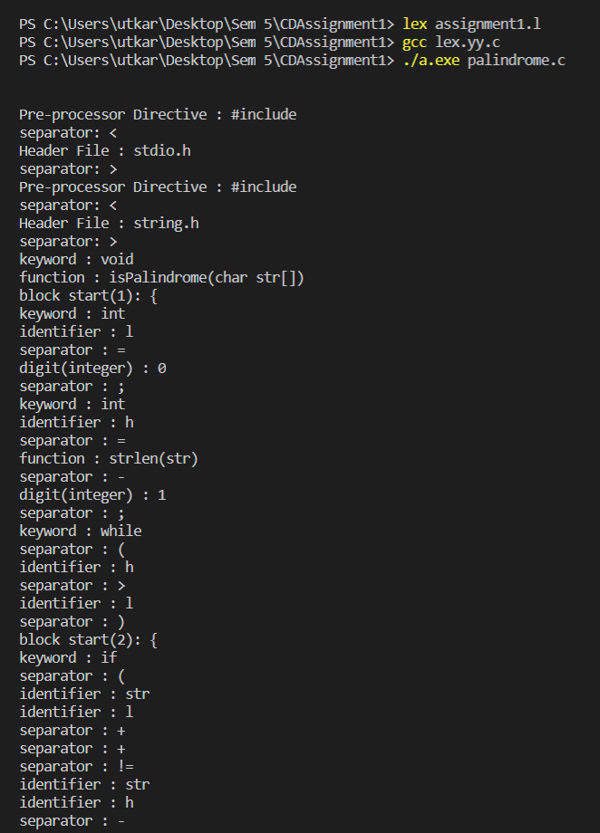

# Lexical Analyzer 

A lexical analyzer written in Lex to tokenize an input C program file and also remove all its comments.

The comments of the input .c file(palindrome.c) is removed and the output is created as out.c file. The input c file is not modified.

### Commands to run

1. lex tokenizer.l
2. gcc lex.yy.c
3. ./a.exe palindrome.c

**NOTE** : Provide the input file through command line.

### Output

 

